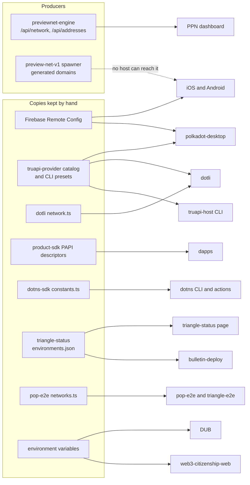
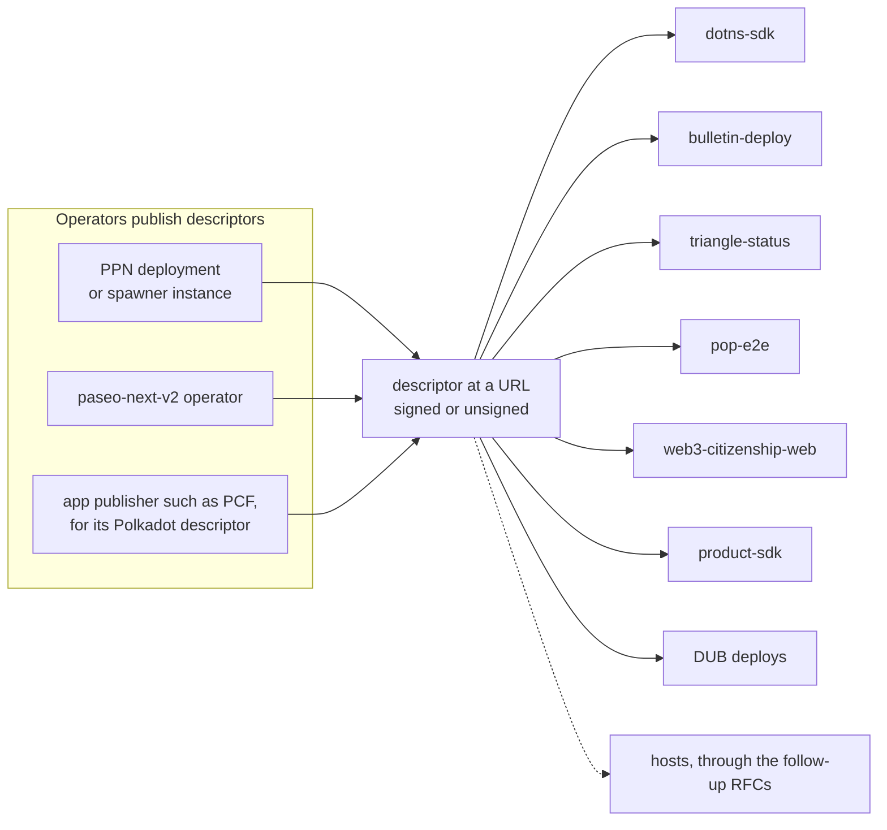

# RFC — Trinity stack descriptor

## Summary

A Trinity stack is one deployment of the chains and services that hosts and tools run against: a relay chain, its system
chains (Asset Hub, People, Bulletin) and off-chain services such as the Device Uniqueness Backend (DUB) and an IPFS
gateway. This RFC defines one JSON document that describes a stack, published by whoever runs it, so that every host and
tool reads the same facts instead of keeping its own copy. How hosts use it is left to follow-up RFCs.

## Motivation

### Background

People reach dapps through hosts, and hosts and the tools around them all run against a stack. The terms below describe
that world as it is today; the design's own terms are introduced in the [Overview](#overview).

- **Host**: an app that runs dapps for a person, such as the Polkadot app on iOS and Android, polkadot-desktop, dotli on
  the web, or the host CLI.
- **Dapp**: an application a host runs, called a product in TrUAPI's terms.
- **Core**: the TrUAPI runtime from host-rust-core that every host embeds. It talks to the chains on the dapp's behalf.
- **Stack**: one deployment of a relay chain, its system chains and off-chain services such as the DUB. Polkadot,
  previewnet and paseo-next-v2 are stacks, and so is a two-hour fork brought up by the Product Preview Network (PPN).
- **Operator**: whoever signs and publishes a stack's descriptor. Usually that is whoever runs the stack, such as PPN
  for previewnet. Polkadot has no single runner, so each app publisher, such as the Polkadot Community Foundation (PCF),
  is the operator of the Polkadot descriptor its apps ship.

### Who reads stack facts today

Every repository below keeps its own copy of some stack's facts. The last column says whether the repository, as already
built and released, can use a stack that did not exist when that version shipped, such as a two-hour PPN fork:

| Repository                                     | Facts it reads                                                                                  | Where they come from                                                             | Can use a new stack without a new version?                       |
| ---------------------------------------------- | ----------------------------------------------------------------------------------------------- | -------------------------------------------------------------------------------- | ---------------------------------------------------------------- |
| iOS and Android (`hosts/ios`, `hosts/android`) | chains with genesis and RPCs, DUB, IPFS gateway, dotNS addresses, TURN credentials from the DUB | Firebase Remote Config, chosen by build flavour                                  | no                                                               |
| polkadot-desktop                               | the same Firebase keys, plus a channel list and a TURN host and secret                          | Firebase, `VITE_ENVIRONMENTS`, `VITE_WEBRTC_TURN_*`, the truapi-provider catalog | no; dev builds can add single RPC chains for dapps               |
| dotli-community                                | genesis, RPCs, IPFS gateway, dotNS registry contract and TLD                                    | `packages/config/src/network.ts`, the truapi-provider catalog                    | no; Docker builds can change endpoints of its bundled networks   |
| host-rust-core                                 | genesis and chain specs, CLI endpoints, dotNS TLDs                                              | the truapi-provider catalog, `truapi-host-cli` presets, `DOTNS_TLDS`             | no                                                               |
| product-sdk                                    | genesis per environment, dotNS addresses, Bulletin RPCs                                         | bundled PAPI descriptors and constants                                           | no                                                               |
| dotns-sdk                                      | RPCs, genesis, contract addresses, IPFS gateway                                                 | `constants.ts`                                                                   | partly: RPC endpoints by flag, contract addresses need a release |
| bulletin-deploy                                | chains, IPFS gateway, TLD, contract addresses                                                   | a snapshot of `triangle-status/environments.json`                                | yes, with `--environment-file`                                   |
| triangle-status                                | chains by environment, DUB, IPFS gateway, dotNS addresses                                       | its own `environments.json`                                                      | no                                                               |
| polkadot-pop-e2e                               | Asset Hub, People and Bulletin RPCs, DUB, IPFS gateway                                          | `networks.ts` and `FORK_*` variables                                             | partly, with `FORK_*` variables                                  |
| device-uniqueness-backend                      | People and Asset Hub RPCs, a People genesis hash                                                | environment variables                                                            | yes, by editing its environment and restarting                   |
| web3-citizenship-web                           | RPCs, IPFS gateway, dotNS protocol registry contract                                            | environment variables and a closed environment list                              | only in place of one of its two environments                     |

How the copies reach their readers:



### What goes wrong

- **Wipes.** Catching up with one round of previewnet and paseo-next-v2 wipes took 11 files in host-rust-core
  ([#579](https://github.com/paritytech/host-rust-core/pull/579)) and a separate dotli change, and until then
  `truapi-host dev` declined every People and Asset Hub request that named the live genesis hash. Previewnet was wiped
  again on 2026-09-17, and the provider catalog, the CLI presets, dotli, product-sdk
  ([#242](https://github.com/paritytech/product-sdk/issues/242)) and web3-citizenship-web still carry the hashes from
  before it.
- **Short-lived stacks.** The spawner brings up a fork for two hours, and no phone can reach it: iOS and Android map
  their build configurations onto three fixed stacks. pop-e2e reaches it only through `FORK_*` variables filled in by
  hand.
- **Names.** The same network is `previewnet`, `preview`, `ppn` or `unstable` depending on the repository, and
  paseo-next-v2 is also `paseo-v2`, `paseo` and `nightly`. iOS reports its previewnet build to dapps as network
  `polkadot`, while dotli reports `previewnet`.
- **Copies drift.** triangle-status carries three previewnet dotNS addresses that differ from the chain, and dotns-sdk
  carries a stale paseo-v2 StoreFactory. Within the core, the signing role reads Asset Hub's genesis hash from two
  sources that nothing reconciles ([#798](https://github.com/paritytech/host-rust-core/issues/798)).
- **ICE** (STUN and TURN, which WebRTC uses to connect peers). Android and desktop hardcode Google's STUN servers. iOS
  and Android ask the DUB for short-lived TURN credentials, while desktop derives them from a TURN relay secret compiled
  into its build.

### Requirements

The format has to meet three requirements:

1. **Single.** Each fact about a stack lives in its descriptor, and every host and tool reads it there instead of
   keeping a copy. When previewnet is wiped, its operator publishes the new genesis hashes once, and no app or tool
   ships a release.
2. **Verifiable.** A reader can tell that a signed descriptor comes from the stack's operator, and that it is not older
   than one it already accepted.
3. **Evolvable.** The format can gain fields without breaking readers that do not know them.

## Stakeholders

- **Stack operators**: PPN, teams running their own testnets, and app publishers such as PCF for the Polkadot descriptor
  their apps ship.
- **Tool developers**: dotns-sdk, bulletin-deploy, pop-e2e, triangle-status, product-sdk and web3-citizenship-web. They
  read stacks from descriptors instead of their own tables.
- **Service operators**: the DUB and other off-chain services. Their URLs live in one place.
- **Host developers**: iOS, Android, polkadot-desktop, dotli and the host CLI, through the follow-up RFCs.

## Detailed Design

MUST, SHOULD and MAY are used as in BCP 14 (RFC 2119 and RFC 8174), for the rules readers and operators follow.

### Overview

An operator publishes a **descriptor**: a JSON document that lists its stack's chains with their genesis hashes and RPC
endpoints, and its services such as the DUB. A reader finds it through a **pointer**: the descriptor's URL, plus the
operator's public key when the descriptor is signed. A reader checks the signature when there is one, and checks the
genesis hashes against the live chains before relying on it.



### Descriptor fields

A descriptor is a JSON file. It changes in three ways, and each has its own field:

| Field        | Changes when                                                | Example                            | What a reader does                             |
| ------------ | ----------------------------------------------------------- | ---------------------------------- | ---------------------------------------------- |
| `sequence`   | the operator publishes anything new, including after a wipe | a new RPC endpoint, or a moved DUB | keeps the descriptor if the number is higher   |
| `generation` | the stack restarts its chains, as after a wipe or a fork    | new genesis hashes after a wipe    | drops what it cached about the old chains      |
| `$v`         | the format changes in a way older readers would misread     | a field renamed or removed         | skips the stack if it does not know the number |

A stack keeps its name when it is wiped, but its chains are new and so are their genesis hashes. Each run between wipes
is a **generation**, and the `generation` field names it, such as `2026-09-17T16:15:00Z` for the previewnet run that
started that day. A reader that sees a new generation drops what it cached about the old chains, such as a light
client's database, and keeps what belongs to the stack itself.

`$v` is the format version, and this RFC defines `$v: 1`. Readers MUST ignore fields and service kinds they do not know,
so adding either keeps `$v: 1` and older readers keep working. Only a change older readers would misread takes a new
number. An operator that makes such a change publishes the new format at a new URL and MUST keep serving the old format
at the existing URL, updated alongside the new one, for as long as builds that read it are in use. Newer builds point at
the new URL. The format is not part of the TrUAPI protocol, so dapps never see it.

```typescript
type Descriptor = {
  $v: 1;
  sequence: number; // Raised on every publish.
  generation: string; // Opaque, non-empty. Changes whenever the stack restarts its chains.
  id: string; // The stack's name, e.g. "previewnet". Tools and logs use it; it never decides trust and is not unique.
  name: string; // Display name. Shown to people; never used to identify the stack.
  network: string; // The ecosystem get_chain_info (RFC 0026) reports to dapps, e.g. "paseo" for previewnet and paseo-next-v2.
  tld: string; // dotNS TLD without the leading dot, e.g. "testnet".
  expiresAt?: string; // Time after which the stack no longer exists. Short-lived stacks only.
  validUntil?: string; // Time after which the descriptor is stale.
  chains: Chain[];
  services: Service[];
  assets?: Asset[]; // Assets readers treat specially, such as the one a wallet pays in.
  contracts?: Record<string, string>; // Asset Hub contracts readers need that the chains do not point to, by name.
  coinage?: { chain: string; instance: number }; // Chain role and instance of the Coinage pallet, the on-chain payment system.
};

type Chain = {
  role: "Relay" | "AssetHub" | "People" | "Bulletin" | string; // RFC 0026 roles; other roles, such as "Web3Storage", serve tools.
  genesisHash: string;
  paraId?: number; // Required on every chain but the relay, and absent on the relay.
  rpc: string[]; // WebSocket endpoints, most preferred first. Not empty.
  statementStore?: boolean; // The chain's nodes serve the statement store.
  lightSpec?: SpecFile; // Light-client chain spec, the kind smoldot loads.
  fullSpec?: SpecFile; // Full chain spec with the whole genesis storage, for running a node.
};

type SpecFile = {
  url: string;
  sha256: string; // SHA-256 of the bytes as served, before HTTP compression.
};

type Service = {
  kind: "dub" | "turn" | "stun" | "ipfs-gateway" | "hop" | "eth-rpc" | "storage-provider" | "faucet" | string;
  urls: string[]; // Endpoints, most preferred first. Not empty.
  chainId?: number; // Required for eth-rpc, absent otherwise: the EVM chain id.
};

type Asset = {
  role: "payment" | string; // What it is for. "payment" is the asset a wallet pays and shows balances in.
  chain: string; // Role of the chain that holds it, e.g. "AssetHub".
  pallet: string; // Pallet that holds it, e.g. "Assets".
  id: number; // Its id in that pallet. Symbol and decimals come from the pallet's metadata.
};
```

The types and the format rules below are normative. A JSON Schema and conformance vectors that follow them will be
published with the first reader implementation. Where they differ from this RFC, this RFC is authoritative.

- A descriptor MUST be I-JSON (RFC 7493): valid UTF-8, with no duplicate member names. Readers MUST refuse one that is
  not.
- Each chain `role`, each service `kind` and each `Asset.role` MUST appear at most once. A descriptor MUST have exactly
  one `Relay` chain, and `paraId` values MUST be unique. `Asset.chain` and `coinage.chain` MUST name a role present in
  `chains`. Chain roles are those of [RFC 0026](0026-supported-chains.md), plus others such as `Web3Storage`.
- `sequence` MUST be an integer from 0 to 2^53 - 1. Times are RFC 3339 in UTC, ending in `Z`.
- Hex values MUST be 0x-prefixed and lowercase. Genesis hashes, SHA-256 digests and keys are 32 bytes, signatures 64
  bytes, and `contracts` addresses are 20-byte Asset Hub contract addresses.
- URLs, in the descriptor and in a pointer, MUST use `https`, `wss` or, for `stun` services, `stun`. The one exception
  is a URL whose host is a literal address in a private range (`127.0.0.0/8`, `10.0.0.0/8`, `172.16.0.0/12`,
  `192.168.0.0/16`, `::1`, `fc00::/7`, `fe80::/10`), which MAY use `http` or `ws`, so a stack running on a laptop can be
  read on the same network. A hostname never qualifies, so DNS cannot turn a public name into a private address.
- An HTTP service URL is a base URL ending in `/`, and readers resolve paths relative to it. `eth-rpc` URLs are JSON-RPC
  endpoints used as given.

A chain has two kinds of chain spec, for two kinds of reader:

- **A light spec**, often named `*.smol.json`, carries the genesis state root instead of the genesis storage. It is
  under 1 KiB for each of previewnet's parachains. The relay's also carries a sync checkpoint, so a light client does
  not sync from genesis, and it is about 270 KiB. Light clients load light specs.
- **A full spec** carries the whole genesis storage, between 2 and 18 MB for each of previewnet's chains. Only a node
  needs it, such as a team's own RPC node joining the stack.

An operator keeps the relay's checkpoint fresh by publishing a new light spec and raising `sequence`.

The service kinds `$v: 1` defines:

| Kind               | What it is                                              | How readers use `urls`                                                                          |
| ------------------ | ------------------------------------------------------- | ----------------------------------------------------------------------------------------------- |
| `dub`              | the Device Uniqueness Backend                           | base URLs; readers call `api/v1/...` under them                                                 |
| `turn`             | a TURN credential issuer, a role the DUB serves         | `POST api/v1/turn/issue` returns the stack's STUN and TURN servers with short-lived credentials |
| `stun`             | STUN servers, which need no credentials                 | `stun:` URLs, passed to WebRTC as given                                                         |
| `ipfs-gateway`     | a path-style IPFS gateway                               | content at `${url}${cid}`                                                                       |
| `hop`              | Bulletin HOP (its peer-to-peer file transfer) endpoints | WebSocket URLs                                                                                  |
| `eth-rpc`          | Ethereum JSON-RPC in front of Asset Hub                 | JSON-RPC URLs, with `chainId`                                                                   |
| `storage-provider` | a Web3 Storage provider node                            | base URLs                                                                                       |
| `faucet`           | a page or API that funds test accounts                  | base URLs                                                                                       |

The DUB's API, including `api/v1/turn/issue` and the access token it requires, is described in the DUB's
[API reference](https://github.com/paritytech/device-uniqueness-backend-community/blob/main/docs/api-reference/openapi.json).

A descriptor leaves out anything a reader can learn from the chains or from a service, so the two never disagree. These
facts are deliberately not in a descriptor, and readers get them from elsewhere:

| Fact left out                                       | Where readers get it                                                                    |
| --------------------------------------------------- | --------------------------------------------------------------------------------------- |
| dotNS contract addresses                            | Asset Hub's `DotnsGateway.DispatcherAddress`, then the dotNS protocol registry contract |
| token symbol, decimals, SS58 prefix                 | each chain's properties                                                                 |
| an asset's symbol and decimals                      | the pallet's metadata for that asset                                                    |
| runtime versions and transaction extension versions | each chain's runtime and metadata                                                       |
| DUB attester                                        | the DUB's `api/v1/attester`                                                             |
| TURN servers and their short-lived credentials      | the `turn` service, when needed                                                         |

Previewnet's descriptor follows, with spec digests shortened to `...` and the specs of four chains left out. Previewnet
has no `expiresAt`, which a two-hour spawner fork sets to the end of its lifetime, and no `contracts`, which a stack
sets when it runs an account data store contract. Its STUN and TURN relay comes with the next deploy of
previewnet-engine ([#38](https://github.com/paritytech/previewnet-engine/pull/38)):

```json
{
  "$v": 1,
  "sequence": 42,
  "generation": "2026-09-17T16:15:00Z",
  "id": "previewnet",
  "name": "Previewnet",
  "network": "paseo",
  "tld": "testnet",
  "validUntil": "2026-10-14T00:00:00Z",
  "chains": [
    {
      "role": "Relay",
      "genesisHash": "0x860145753657e73c29b9388ffa0a8aebc643ea87434b4b271b6c3c3cc9e6bf92",
      "rpc": ["wss://previewnet.substrate.dev/relay/alice", "wss://previewnet.substrate.dev/relay/bob"],
      "lightSpec": {
        "url": "https://previewnet.substrate.dev/chainspecs/paseo-local.smol.json",
        "sha256": "0x3d71..."
      },
      "fullSpec": { "url": "https://previewnet.substrate.dev/chainspecs/paseo-local.json", "sha256": "0x9f2c..." }
    },
    {
      "role": "AssetHub",
      "paraId": 1500,
      "genesisHash": "0xbac97e23fc8f4bccae72a98f8aeb2bcab20bf755862304e4b46ad6473456e896",
      "rpc": ["wss://previewnet.substrate.dev/asset-hub"]
    },
    {
      "role": "People",
      "paraId": 1502,
      "genesisHash": "0x55e3e689ecfa9d2fffcf7d309b8011956671493982230bfd0420c683542249e9",
      "rpc": ["wss://previewnet.substrate.dev/people"],
      "statementStore": true
    },
    {
      "role": "Bulletin",
      "paraId": 1501,
      "genesisHash": "0xa081192b90c1f6a3f8e9ce7b2a8246f41af805c66456c84e05fd97c2b3502425",
      "rpc": ["wss://previewnet.substrate.dev/bulletin"]
    },
    {
      "role": "Web3Storage",
      "paraId": 1600,
      "genesisHash": "0x657ea8ebccf876d41af44871d758866479cde100134b58e9d08ed7e3e4e60282",
      "rpc": ["wss://previewnet.substrate.dev/web3-storage"]
    }
  ],
  "services": [
    { "kind": "dub", "urls": ["https://previewnet.substrate.dev/dub/"] },
    { "kind": "turn", "urls": ["https://previewnet.substrate.dev/dub/"] },
    { "kind": "stun", "urls": ["stun:previewnet.substrate.dev:3478"] },
    { "kind": "ipfs-gateway", "urls": ["https://previewnet.substrate.dev/ipfs/"] },
    { "kind": "hop", "urls": ["wss://previewnet.substrate.dev/bulletin"] },
    { "kind": "eth-rpc", "urls": ["https://previewnet.substrate.dev/eth-rpc"], "chainId": 420420417 },
    { "kind": "storage-provider", "urls": ["https://previewnet.substrate.dev/web3-storage-provider/"] },
    { "kind": "faucet", "urls": ["https://sudo.personhood.dev/"] }
  ],
  "assets": [{ "role": "payment", "chain": "AssetHub", "pallet": "Assets", "id": 50000413 }],
  "coinage": { "chain": "People", "instance": 0 }
}
```

The whole descriptor is a few kilobytes. A wipe changes `generation`, the genesis hashes and the chain spec hashes, and
the operator raises `sequence` when it publishes the result. The follow-up RFC on hosts maps today's Firebase keys onto
these fields ([#1312](https://github.com/paritytech/trinity-user-agents/issues/1312)).

### Pointer and signing

```typescript
type Pointer = {
  url: string; // Where the descriptor lives.
  key?: string; // Operator's Ed25519 public key. Present when the descriptor is signed.
};
```

A wipe changes the descriptor and never the pointer, so a reader that holds a pointer follows its stack through every
wipe. A stack's identity is its key when it is signed, and otherwise its URL, compared after RFC 3986 normalisation
(sections 6.2.2 and 6.2.3) without its fragment. An operator that wants mirrors puts them behind its one URL, for
example with a CDN. A follow-up RFC on importing stacks defines how a pointer travels as a link or a QR code.

A signed descriptor travels inside an envelope, so readers verify the exact bytes the operator signed and never
re-encode JSON to check a signature:

```typescript
type Envelope = {
  $v: 1; // Moves together with the descriptor's $v and the version in the signing prefix.
  payload: string; // Standard base64 (RFC 4648 section 4, with padding) of the descriptor's UTF-8 bytes.
  signature: string; // Ed25519 signature over the signing prefix and the payload bytes.
};
```

- The signature is pure Ed25519 (RFC 8032) over the ASCII bytes of `trinity-stack/descriptor/v1`, with no separator,
  followed by the decoded payload bytes. Readers MUST verify strictly: they reject `S` not below the group order `L`, a
  non-canonical encoding of the public key `A` or of `R`, and a small-order `A` or `R`, and they use the cofactorless
  equation, as ed25519-dalek's `verify_strict` does. `signature` is 64 bytes in lowercase 0x-prefixed hex. The prefix
  keeps a descriptor signature from being valid as any other signed message.
- A document with a `payload` member is an envelope, and any other document is a plain descriptor. A reader MUST refuse
  an envelope whose payload `$v` differs from the envelope's `$v`.
- A pointer with a `key` MUST accept only an envelope that verifies against it. A reader MUST NOT fall back to a plain
  descriptor for it.
- A pointer without a `key` reads a plain descriptor, with TLS as its only protection. That fits a stack whose
  descriptor is served by the stack itself, such as a two-hour PPN fork. A reader MAY read an envelope through it,
  treating it as unsigned, so a tool given only a URL can still read a signed stack.
- One key MUST sign only one stack. A key that signs two stacks would let whoever serves one URL swap in the other
  stack's descriptor.
- `sequence` only rises; how an operator produces it is its choice. A reader stores the highest `sequence` it accepted
  for a signed stack and MUST refuse a lower one, so an old descriptor cannot be replayed after a wipe. On an equal
  `sequence` with different content, it keeps the one it holds. Unsigned stacks get no rollback protection.
- An operator that sets `validUntil` SHOULD republish before that time. A reader holding a descriptor past its
  `validUntil` that cannot fetch a newer one MAY keep using it, but MUST report it as stale.
- Changing a stack's key means new pointers.

### Validation

A reader MUST refuse a descriptor that breaks a format rule, as a whole. For each chain it uses, it MUST check that the
genesis hash the chain reports equals `genesisHash`, and that each spec it loads matches its `sha256` and its chain's
`genesisHash`, and MUST NOT use a chain that fails. A chain that cannot be reached is unavailable, not wrong. The
follow-up RFCs add host checks, such as how far a host trusts what a chain answers.

### Publishing

An operator MUST publish a new descriptor whenever something a descriptor carries changes, and raise `sequence` each
time. It SHOULD take genesis hashes and specs from the live chains rather than copy them by hand, and SHOULD have a
person approve each publish when the key guards a stack with real funds. A runtime upgrade or a dotNS redeploy needs no
publish, because readers read those from the chains.

How an operator does this is its choice. [Appendix A](#appendix-a-how-operators-publish-today) shows how
previewnet-engine and a git-kept stack such as paseo-next-v2 would.

### Readers

A tool reads a stack from a pointer or a local file, and runs the checks under [Validation](#validation). A local file
has no identity and no rollback protection, and is trusted as far as its source. Every reader implementation, in the
host core or in a tool, MUST pass the conformance vectors once they are published, so all of them accept and refuse the
same descriptors. [Appendix B](#appendix-b-changes-per-tool) lists what changes in each tool today.

## Drawbacks

- The operator of a signed stack holds a signing key. Losing it means new pointers for the stack.
- An unsigned stack trusts its web server, DNS and TLS. Whoever controls its host can change its services.
- Verification exists in more than one implementation, and the conformance vectors must keep them in agreement.
- A stack kept by hand needs automation and a guarded key, where today it needs a Firebase edit.

## Security

- **Replay and rollback.** The sequence rule refuses an older signed descriptor for the same stack, and the signing
  prefix keeps a descriptor signature from standing in for any other signed message.
- **Downgrade.** A keyed pointer never accepts a plain descriptor.
- **Key reuse.** A key that signs two stacks lets one be swapped for the other, which is why one key signs one stack.
- **Stolen keys.** A stolen key can point its stack at other chains and services, or publish the highest possible
  `sequence` and lock the operator out. Recovery means new pointers.
- **Unsigned stacks.** Whoever controls the descriptor's host controls the stack, which is acceptable only where that
  host is the stack itself or the reader's own network.
- **TURN.** A descriptor never carries a TURN secret. Readers ask the `turn` service for short-lived credentials, which
  it issues against an access token from the DUB.
- **Availability.** A reader keeps its last verified copy while the descriptor is unreachable.

## Alternatives Considered

Designs that were considered and not chosen, each with the reason:

- **Firebase Remote Config for every stack.** The mobile and desktop apps already read it. Its permissions cover a whole
  project, so an operator who can publish a stack can also edit production configuration, and tools and CI would need
  Google credentials to read it. Firebase can still serve a signed descriptor, because readers check the signature, not
  where the bytes came from.
- **Extending `/api/network`.** It describes how to run a stack, lists nodes rather than roles, and exists only for the
  stacks PPN runs.
- **One unsigned file per network in git, next to the chain specs.** It works for long-lived networks and is kept as an
  input to published descriptors, but it cannot reach a two-hour fork and gives a reader nothing to verify.
- **Several URLs per pointer, and key rotation inside the descriptor.** Both add rules that are hard to get right, for
  cases a single URL with a CDN and a new pointer cover.
- **Descriptors in dotNS text records.** A reader would need one stack connected before it could read another's
  descriptor, and the records are wiped with the testnet that holds them.

## Future Directions

Three follow-up RFCs, tracked in [#1312](https://github.com/paritytech/trinity-user-agents/issues/1312), build on this
one:

- **Hosts load stacks from descriptors**: hosts ship descriptors instead of chain tables.
- **Importing stacks at runtime**: people add stacks to a host at runtime.
- **Pairing across stacks**: paired hosts agree on one stack.

## Appendices

The appendices are informative.

### Appendix A: how operators publish today

previewnet-engine can build the descriptor once every chain is up, sign it, and serve it next to `/api/network`, for
example at `/.well-known/trinity-stack.json`. The spawner can publish each instance's descriptor unsigned, because the
instance is the only host that serves it. The engine already knows each field:

| Descriptor field                 | Source in previewnet-engine                                                                                                                                                   |
| -------------------------------- | ----------------------------------------------------------------------------------------------------------------------------------------------------------------------------- |
| `chains[].genesisHash`           | `chain_getBlockHash(0)` on each chain once it is up                                                                                                                           |
| `chains[].rpc`                   | `chains[].url` from `/api/network`; the relay gets every `relay-*` validator's URL                                                                                            |
| `chains[].fullSpec`              | `chains[].links.spec`, hashed as it is served                                                                                                                                 |
| `chains[].lightSpec`             | planned: built from the full spec, with the relay's checkpoint from a relay node's `sync_state_genSyncSpec`                                                                   |
| `services[]`                     | the `dub`, `ipfs-daemon`, `eth-rpc` and `storage-provider-node` entries of `/api/network`, and `hop` is the Bulletin RPC                                                      |
| `services[]` `turn` and `stun`   | the `ice` entry of `/api/network`: `turn` is the DUB behind its `credentialsUrl`, and `stun` is its `stun:` server, served by the eturnal TURN relay PPN runs next to the DUB |
| `services[]` `faucet`            | the deployment's configuration                                                                                                                                                |
| `assets`, `contracts`, `coinage` | the network file, for stacks that set them up at genesis                                                                                                                      |
| `tld`                            | the network file's `genesisConfig.networkSuffix`                                                                                                                              |
| `generation`                     | the spawn record in `/api/provenance`                                                                                                                                         |
| `expiresAt`                      | the spawner instance's lifetime, for spawner forks                                                                                                                            |

A stack that no single piece of software runs, such as paseo-next-v2 or Polkadot, can keep its descriptor in a git
repository. CI checks each change against the live chains, signs on merge, and a scheduled job opens a pull request with
new genesis hashes and specs after a wipe.

### Appendix B: changes per tool

| Repository                | Change                                                                                  |
| ------------------------- | --------------------------------------------------------------------------------------- |
| dotns-sdk                 | `--stack <url, link or file>` replaces `--env`; contract addresses come from the chain  |
| bulletin-deploy           | `--stack` replaces the triangle-status snapshot and its drift checks                    |
| triangle-status           | keeps a list of descriptor URLs instead of copies of their facts, and checks each stack |
| polkadot-pop-e2e          | a `STACK` variable replaces the `FORK_*` variables                                      |
| web3-citizenship-web      | its environments are descriptor URLs in its configuration instead of a closed list      |
| device-uniqueness-backend | each deploy writes its `.env` from the descriptor                                       |
| product-sdk               | terminal and cloud-storage presets come from stack descriptors; dapps keep RFC 0026     |
